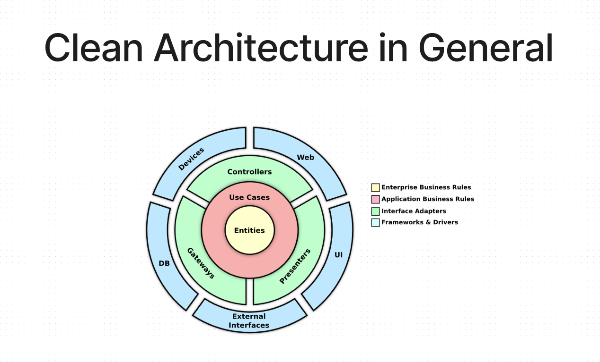
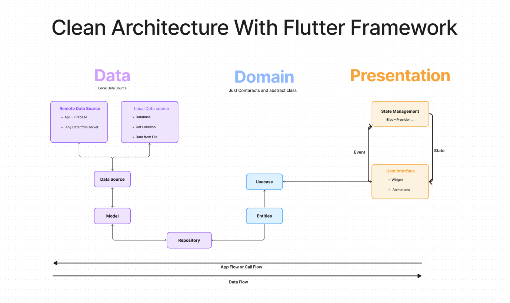

# Clean-Architecture

Clean-Architecture using Flutter

## What is Clean Architecture?

- Separates your application code into layers and these layers define the Separation of Concerns (SOC) inside the codebase
- Software design philosophy that separates the elements of a design into ring levels.

